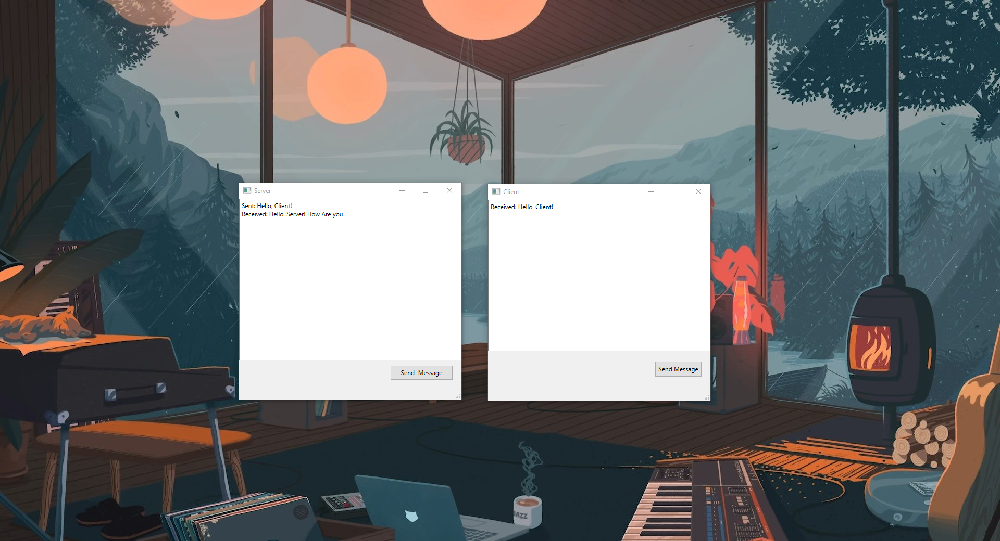
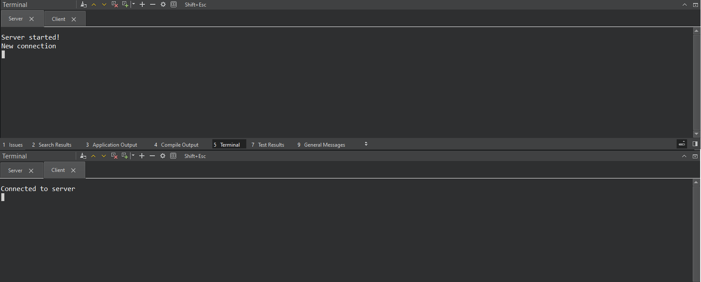
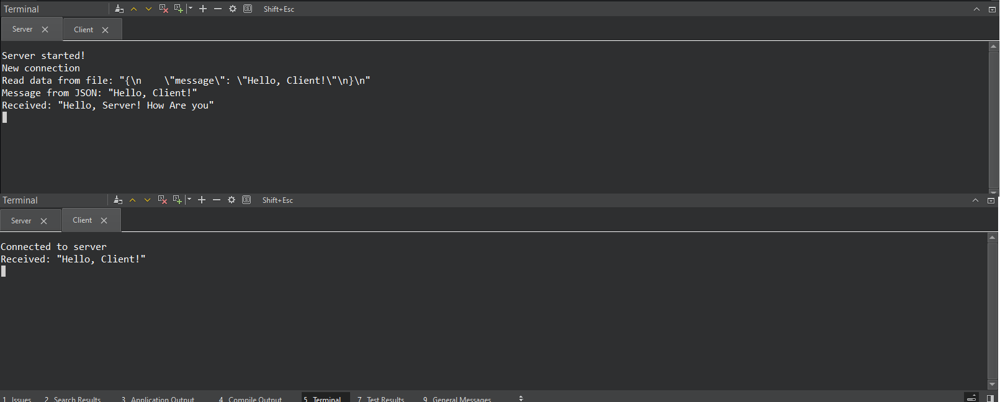

# QtTCPJsonChat

This project is a simple chat application using Qt for TCP server-client communication based on JSON messages. The server reads messages from a JSON file and sends them to the client, while the client can respond back to the server. This project demonstrates basic network communication and JSON handling in a Qt-based C++ application.

---

---

---

# Serial Port Communication with Qt

This project demonstrates a simple serial port communication application built using Qt. The application allows the user to connect to a specified serial port, send data, and receive data from the connected device. The interface includes fields for entering the port name and data to be sent, buttons to connect and send data, and displays for the connection status and received data. The application is designed to work with any serial port device, providing an easy way to test and debug serial communications.

---

---
